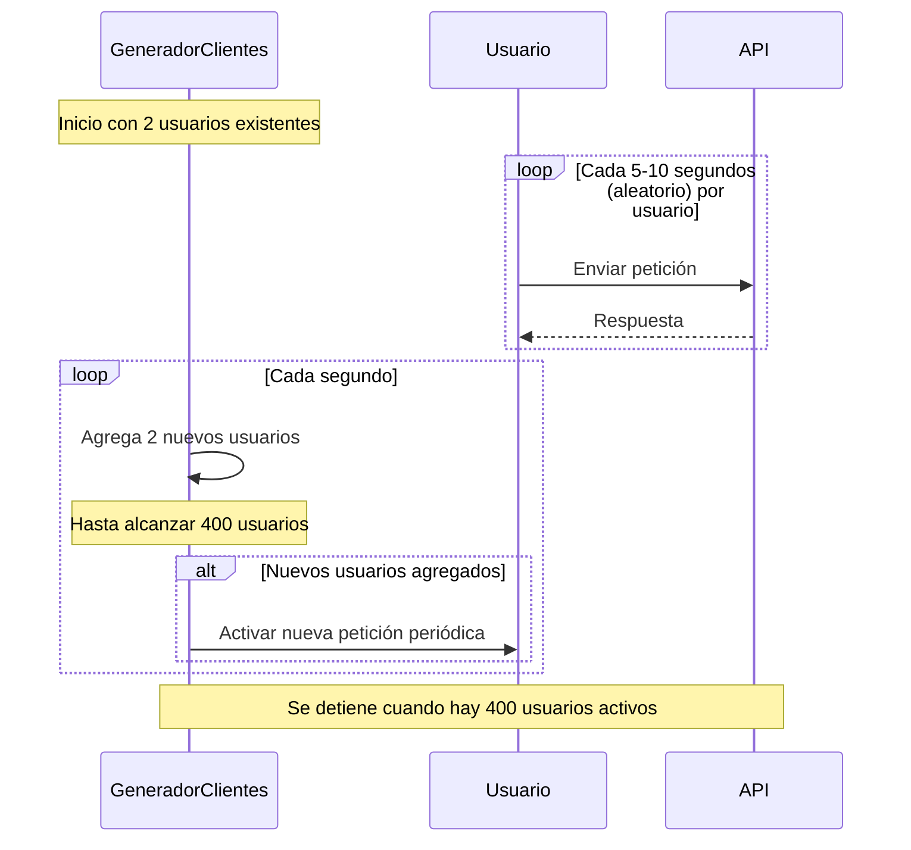
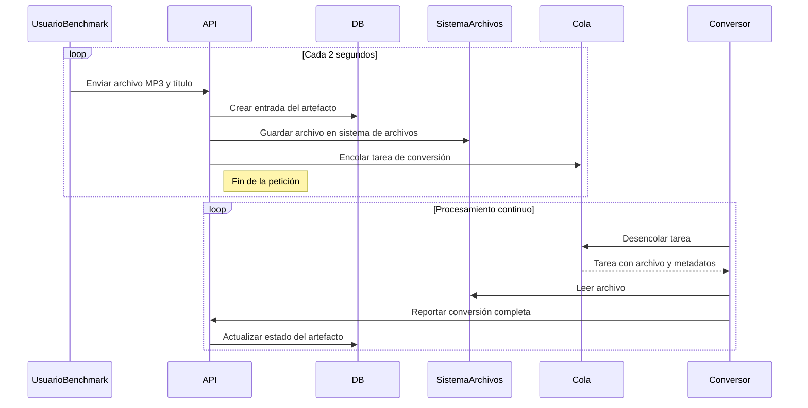

# Plan de Pruebas de Carga y Análisis de Capacidad

## 1. Entorno de Pruebas

### Infraestructura de la aplicación bajo pruebas
Nuestra aplicación está completamente contenerizada usando Docker, lo cual nos permite recrear ambientes de prueba consistentes. Se utilizan los siguientes componentes principales:

- **Manejo de dependencias**: UV
- **Aplicación Backend**: Flask  
  - Versión: 3.1  
  - Lenguaje: Python 3.12  
- **Servidor web**: Gunicorn  
  - Versión: 23.0.0  
- **Base de Datos**: PostgreSQL  
  - Versión: 17.4  
- **Cola de Tareas**: Redis + Celery  
  - Redis: 5.1  
  - Celery: 5.4  
- **Procesamiento de Video (Asíncrono)**: ejecutado por Celery Workers  
- **Proxy Reverso**: NGINX  
  - Versión: 1.27.4

### Software requerido para la ejecución de las pruebas
- Ubuntu Server 24.04 LTS
- Git (ya instalado durante la instalación del SO)
- Servidor OpenSSH (ya instalado durante la instalación del SO)

### Recursos del entorno bajo prueba
- CPU: 1 vCPU  
- Sistema Operativo: Ubuntu 24.04 LTS (64 bits)  
- RAM: 4 GB  
- Disco: 15 GB  
- Red: 1 Gbps (red privada local entre contenedores)

### Herramientas de monitoreo
- **cAdvisor** para métricas de utilización  
- **Grafana + Prometheus** para visualización (opcional en entregas futuras)

---

## 2. Criterios de Aceptación

| Métrica                        | Umbral                        |
|-------------------------------|-------------------------------|
| Tiempo de respuesta promedio  | < 1s                          |
| Throughput                    | > 200 transacciones/minuto    |
| Utilización de CPU            | < 80% sostenido               |
| Utilización de Memoria        | < 80% sostenido               |

---

## 3. Escenarios de Prueba

### Escenario 1: Capacidad de solicitudes
**Objetivo:** Medir la máxima cantidad de peticiones por minuto que soporta la aplicación con usuarios concurrentes.

Este escenario es de vital importancia para conocer la capacidad del sistema bajo una carga sostenida, garantizando un nivel de servicio aceptable.

**Criterios de éxito:**
- Tiempo de respuesta promedio: ≤ 1 segundo
- Pérdidas: < 1%
- Tamaño mínimo del archivo: 5 MB
- Timeout por solicitud: 10 segundos

#### Flujo de ejecución:
- Comienza con 2 usuarios activos
- Cada usuario envía una petición cada 5–10 segundos (aleatorio)
- Cada segundo se agregan 2 nuevos usuarios
- Máximo de 400 usuarios

### Escenario 2: Capacidad de conversión
**Objetivo**: Medir la cantidad de archivos de video que pueden ser procesados (convertidos) por minuto de forma aceptable.

**Criterios de éxito**:
- Tiempo máximo de procesamiento por video: 10 minutos
- Tamaño mínimo del archivo: 5 MB

#### Flujo de ejecución:
- El usuario benchmark sube archivos MP3 al endpoint /videos con título
- API guarda el archivo y crea los artefactos
- API encola la conversión
- Worker desencola y procesa
- Se sube un nuevo archivo cada 2 segundos

### 4. Estrategia de Pruebas
Etapas
- Prueba de humo: con 5 usuarios simultáneos
- Carga progresiva: desde 2 hasta 400 usuarios
- Prueba de estrés: hasta 500 usuarios o hasta que se degrade el sistema

Herramienta de pruebas seleccionada
- Locust: Alta integración con Python, definiciones legibles y manejo sencillo de escenarios de carga complejos.

### 5. Topología de Pruebas
Cliente de carga:
- EC2 m5.large (2 vCPU, 8 GB RAM)
- Región: us-east-1

Servidor:
- Docker en EC2 separada o entorno local

Monitoreo:
- CloudWatch
- cAdvisor

### 6. Recomendaciones de Escalabilidad
- Configurar los workers de Celery para escalar dinámicamente según la demanda (actualmente son 4 fijos).

- Considerar almacenar los archivos procesados en un sistema externo (ej. Amazon S3) para liberar espacio y reducir carga local.
- Escalar horizontalmente utilizando múltiples instancias del sistema si los recursos físicos se convierten en un cuello de botella.

